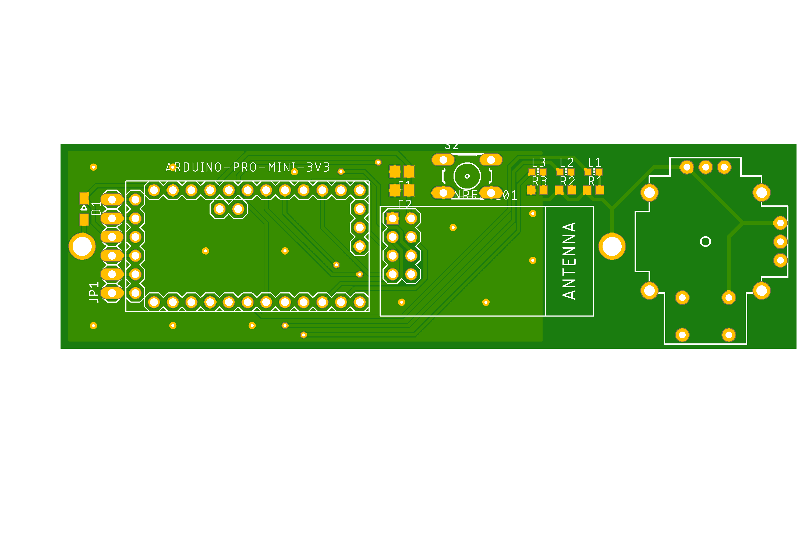
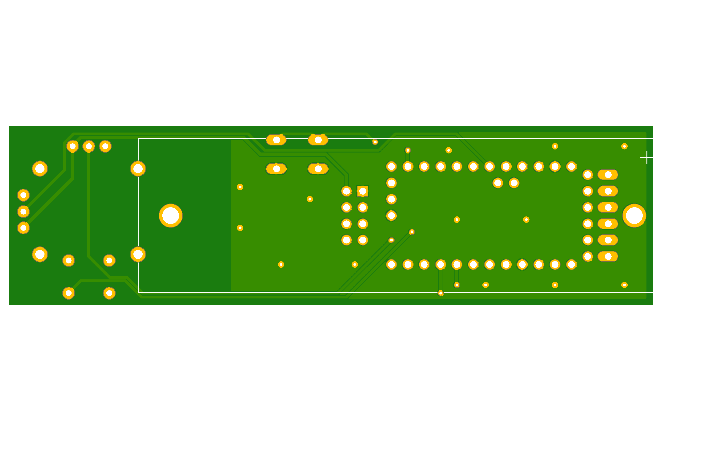

# Longboard-Remote-Controller

A remote controller board that uses an Arduino Nano and a 2.4GHz nRF24 WiFi module to send an analog input from a joystic (thumbstick). Power is provided by a 18650 Lithium-ion (Li-ion/Liion) battery.

## Product

## Top View

## Bottom View
